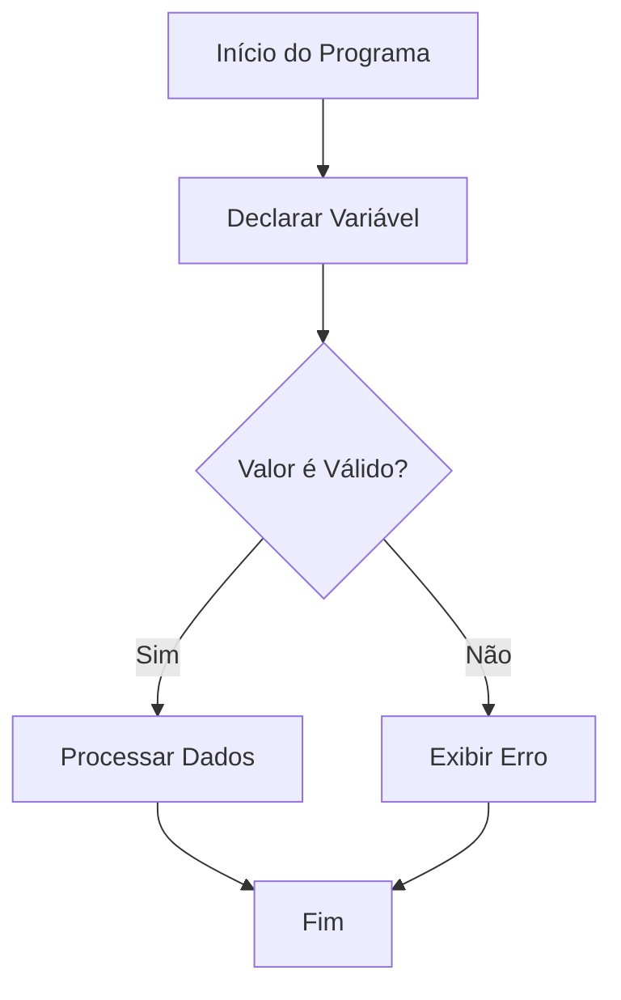

# Aula01Variaveis

##Teste de Edição


# Aula01: Variáveis

| Informações do Aluno | |
| :--- | :--- |
| **Nome:** | [Insira seu nome aqui] |
| **Matéria:** | [Insira o nome da matéria aqui] |
| **Data:** | [Insira a data aqui] |

---

## 📖 Manual de Formatação em Markdown (.md)

Este guia prático ensina como estruturar e formatar arquivos Markdown para documentar seus projetos.

### 1. Títulos (Headings)
Use o símbolo `#` para criar títulos. A quantidade de `#` determina o nível do título (do 1 ao 6).
```text
# Título Principal (H1)
## Subtítulo (H2)
### Título de Seção (H3)
```

### 2. Formatação de Texto
Deixe seus textos mais dinâmicos mudando o estilo da fonte:
* **Negrito:** Envolva o texto com dois asteriscos `**texto**` ou dois underlines `__texto__`.
* *Itálico:* Envolva o texto com um asterisco `*texto*` ou um underline `_texto_`.
* ~~Riscado:~~ Envolva o texto com dois tios `~~texto~~`.

### 3. Listas
Para listas organizadas ou tarefas do dia a dia:

**Lista Não Ordenada (Marcadores):**
* Item A
* Item B

**Lista Ordenada (Numérica):**
1. Primeiro passo
2. Segundo passo

**Lista de Tarefas (Checklist):**
- [x] Variáveis declaradas
- [ ] Código testado

### 4. Blocos de Código (Code Blocks)
Para destacar códigos, use três crases (\`\`\`) seguidas pelo nome da linguagem para ativar a coloração sintática:

```javascript
// Exemplo em JavaScript
let nome = "IA";
const ano = 2026;
console.log(`Olá, ${nome}. Estamos em ${ano}.`);
```

---

## 🎨 Exemplos de Mídia e Elementos Visuais

### Exemplo de GIF
Para inserir GIFs ou imagens, use a sintaxe ``:


### Exemplo de Desenho (Gráficos com Mermaid)
O Markdown permite criar diagramas e desenhos de fluxo diretamente no código usando a ferramenta `mermaid`:



---

## 🚀 Como Usar este Projeto
1. Clone este repositório.
2. Abra o arquivo `README.md` no seu editor (ex: VS Code).
3. Preencha seus dados na tabela no topo do arquivo.
4. Comece a codificar a sua **Aula01 Variáveis**!
